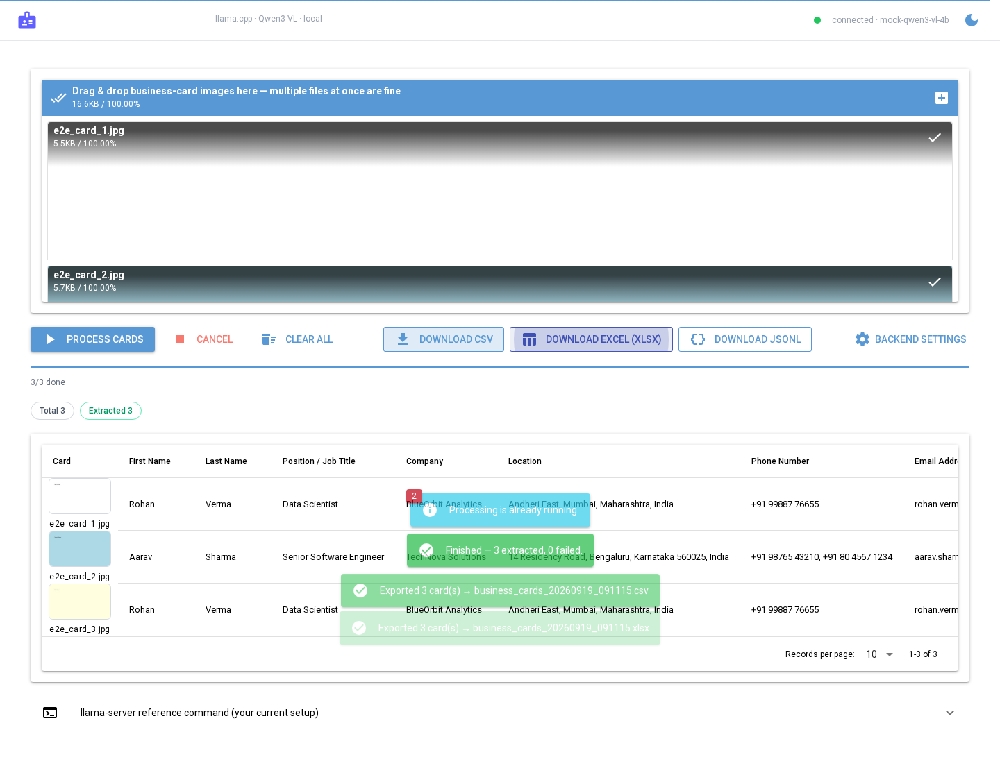

# Business Card Extractor

NiceGUI web app that extracts contact details from business-card images using a
**local llama.cpp vision model** (`llama-server` + Qwen3-VL, OpenAI-compatible API).
Everything runs on your machine — no cloud APIs.



## Features

- Upload **multiple** business-card images at once (drag & drop or file picker)
- Extracts exactly these fields:
  `First Name · Last Name · Position / Job Title · Company · Location · Phone Number · Email Address`
- Zero-hallucination prompt — missing/illegible fields come back as `Null`
- Sequential processing queue (matches your `-np 1` server) with live progress,
  per-card status, per-card timing and summary chips
- Results table with thumbnails
- Export results to **CSV**, **Excel (XLSX)** or **JSONL**
- In-app *Backend settings* dialog (server URL / model / image size / timeout)
  persisted to `settings.json`, plus a "Test connection" button and a live
  connection dot in the header
- Robust JSON parsing — survives accidental ```json fences or chatty preambles
- `mock_llama_server.py` included so you can develop/test the UI **without**
  the model running

## Project layout

```
business-card-extractor/
├── app.py                 # NiceGUI frontend + orchestration (run this)
├── config.py              # fields, prompt, defaults (env-overridable)
├── extractor.py           # llama.cpp client: image prep, request, JSON parsing
├── exporter.py            # CSV / XLSX / JSONL writers
├── mock_llama_server.py   # fake llama-server for UI development
├── requirements.txt
├── Dockerfile             # containerises the NiceGUI app
├── docker-compose.yml     # app + official llama.cpp server, one command
├── screenshot.png         # UI screenshot (regenerated by tests/e2e_test.py)
├── LICENSE
├── deploy/
│   ├── nginx.conf         # reverse proxy for your custom domain (HTTP-only)
│   └── EC2-SETUP.md       # step-by-step AWS EC2 deployment guide
└── tests/
    ├── test_pipeline.py   # end-to-end smoke test, no browser (no model needed)
    └── e2e_test.py        # browser-level test via Playwright (optional)
```

`uploads/` and `output/` are created automatically at runtime and are
git-ignored.

## Docker / EC2 deployment (custom domain)

**Full walkthrough: [`deploy/EC2-SETUP.md`](deploy/EC2-SETUP.md)** — instance
selection, DNS, Docker install, nginx for your domain, troubleshooting.

Quick version:

```bash
# on the EC2 instance (project copied to /opt/business-card-extractor)
docker compose up -d --build        # builds the app + starts llama.cpp server
docker compose logs -f llama        # first run: ~2.5 GB model download, then "listening"

# nginx (edit server_name in deploy/nginx.conf first!)
sudo cp deploy/nginx.conf /etc/nginx/sites-available/business-card-extractor
sudo ln -s /etc/nginx/sites-available/business-card-extractor /etc/nginx/sites-enabled/
sudo rm /etc/nginx/sites-enabled/default
sudo nginx -t && sudo systemctl reload nginx
```

The compose file runs the **official** `ghcr.io/ggml-org/llama.cpp:server`
image with your exact flags (`-hf Qwen/Qwen3-VL-4B-Instruct-GGUF:Q4_K_M
-ngl 0 -t 8 -c 8192 -b 2048 -ub 512 -np 1`); the model download is cached in
a named volume. The app binds to `127.0.0.1:8090` only — the browser talks to
nginx on port 80 (WebSocket-upgrade headers are already configured, which
NiceGUI requires).

## 1. Start the llama.cpp backend

Your existing command works as-is:

```bat
.\llama-server.exe -hf Qwen/Qwen3-VL-4B-Instruct-GGUF:Q4_K_M -ngl 0 -t 8 -c 8192 -b 2048 -ub 512 -np 1 --port 8080
```

## 2. Install and run the app

Windows:

```bat
py -3.11 -m venv .venv
.venv\Scripts\activate
pip install -r requirements.txt
python app.py
```

macOS / Linux:

```bash
python3 -m venv .venv
source .venv/bin/activate
pip install -r requirements.txt
python app.py
```

Open **http://localhost:8090** (8080 is left for llama-server).

## Configuration

| Setting | Env var | Default | Notes |
|---|---|---|---|
| llama-server URL | `LLAMA_SERVER_URL` | `http://localhost:8080` | base URL (no path) |
| Model id | `LLAMA_MODEL` | `default` | whatever you send in the payload |
| Max image size (px) | `LLAMA_MAX_SIZE` | `1024` | longest side, resized before sending |
| Request timeout (s) | `LLAMA_TIMEOUT` | `600` | CPU inference can be slow |
| App host | `HOST` | `127.0.0.1` | use `0.0.0.0` to expose on LAN |
| App port | `PORT` | `8090` | |

Environment variables are read at startup; afterwards use the **Backend
settings** dialog (gear icon) — changes are saved to `settings.json` and take
effect immediately.

## Testing the UI without the model

```bat
python mock_llama_server.py            :: fake llama-server on :8081
set LLAMA_SERVER_URL=http://localhost:8081
python app.py
```

The mock returns deterministic sample cards (same image → same card), so you
can exercise upload → queue → table → CSV/XLSX download end-to-end.

## Smoke test (no model needed)

```bash
python tests/test_pipeline.py
```

Starts the mock server, generates 3 sample card images, runs extraction and
all three exporters, and validates the output.

## Browser-level E2E test (optional)

```bash
pip install playwright
playwright install chromium
python app.py                    # in one terminal (with mock or real server)
python tests/e2e_test.py         # in another
```

Drives a real Chromium: uploads 3 cards at once, waits for the table to show
`Done`, downloads the CSV and XLSX and validates their contents, and
regenerates `screenshot.png`.

## How it works

1. `ui.upload` (multiple, auto-upload) saves each image to `uploads/` and
   builds a small in-browser thumbnail.
2. Cards enter a queue; the app processes them **one at a time**
   (`-np 1`) by calling `POST /v1/chat/completions` with your exact payload
   pattern: text prompt first (KV-cache friendly), resized base64 image second,
   `temperature: 0.0`.
3. The response is parsed defensively (fences / chatter / missing keys) and
   normalised so all 7 fields are always present, with `Null` for missing data.
4. Exports are written to `output/` and streamed to the browser via
   `ui.download`. The CSV uses UTF-8 BOM so Excel opens it without mojibake.

## Notes & tips

- CPU-only (`-ngl 0`) inference of a 4B vision model takes tens of seconds per
  card — that's why processing is sequential, cancellable, and shows a live
  progress bar.
- The app is a single-user local tool (one shared in-memory session).
- If a card fails (server hiccup, timeout), it shows a red **Error** with the
  reason; hit **Process cards** again to retry just the failed ones.
- Keep `LLAMA_MAX_SIZE` ≤ 1024 on CPU to keep prompt tokens (and therefore
  per-card latency) down.

## Publishing

The repo is ready to push — just connect your remote:

```bash
git remote add origin https://github.com/<your-username>/business-card-extractor.git
git push -u origin main
```

Before publishing: replace `<YOUR NAME>` in `LICENSE` (or pick another
license), and double-check you're not committing anything you don't want
public (`git status` / `git diff --cached`). `settings.json`, `uploads/` and
`output/` are already git-ignored.
